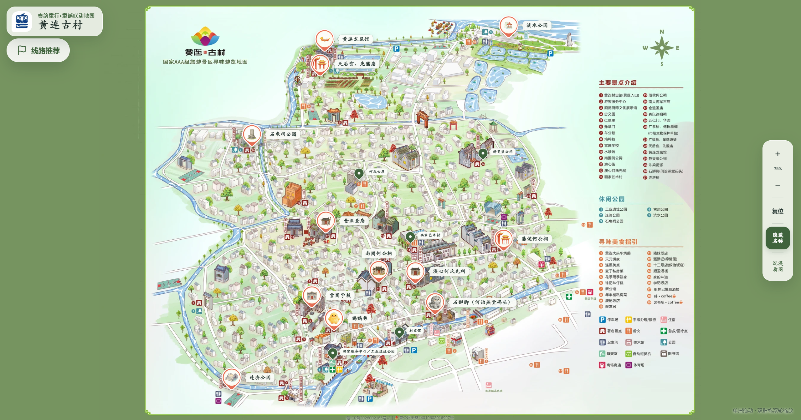
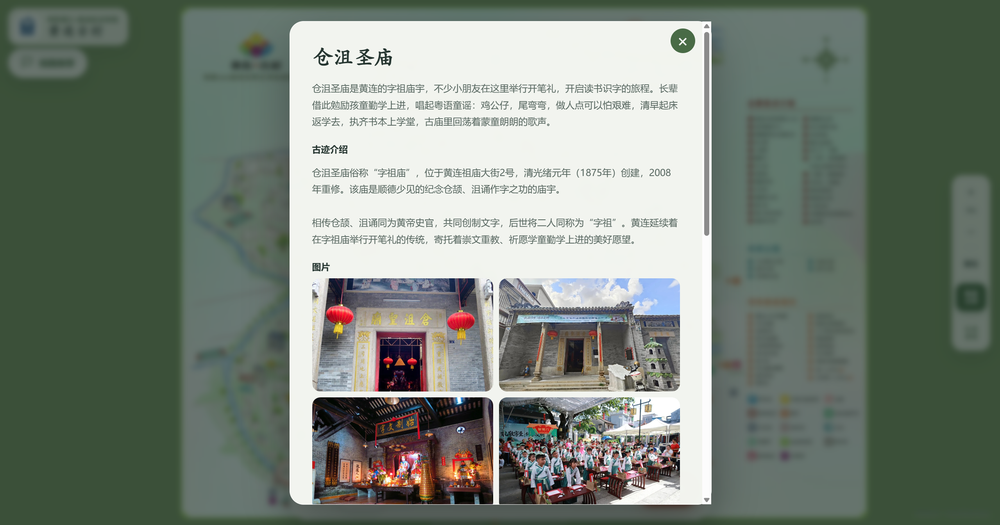
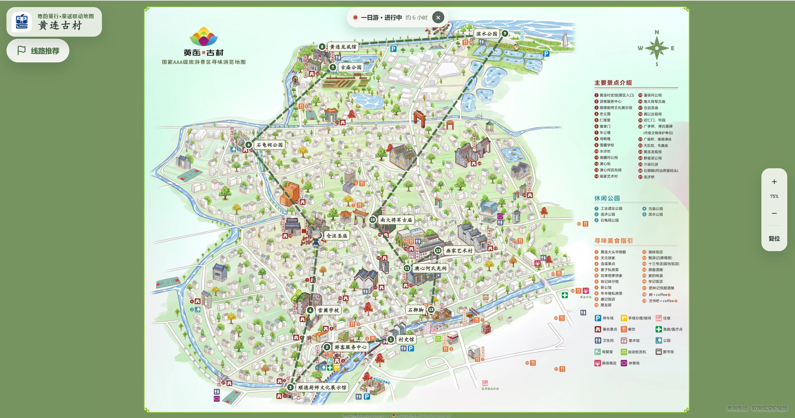

# 黄连古村联动导览

黄连古村联动导览是“粤韵童行”的地图网站。我们把古村里的景点、故事和粤语童谣放进一张手绘地图，希望大家在游览黄连时，既能找到想去的地方，也能听听这里的童谣，了解这里的文化。

**在线访问：[黄连古村联动导览](https://www.yueyuntongxing.cloud/)**

## 在这里可以做什么

拖动、放大地图，看看黄连古村的街巷与景点。点击地图上的地点，就能查看介绍、浏览照片，或播放相关的童谣和视频。

地图目前收录了 **12 个童谣景点和 5 个文化介绍点位**，还提供半日游和一日游线路，方便安排游览。找到想去的地方后，可以打开高德、百度、腾讯或 Apple 地图导航。

如果只想欣赏手绘地图，也可以点击“沉浸看图”，把地图上的点位隐藏起来。

## 页面截图

### 首页地图



### 景点介绍



### 游玩线路



## 本地运行

项目使用 HTML、CSS 和原生 JavaScript 编写，不需要安装 npm 依赖，也没有额外的构建步骤。

安装 Python 3 后，在项目目录打开终端，运行：

```powershell
python -m http.server 5500 --bind 127.0.0.1
```

然后在浏览器打开 [本地页面](http://127.0.0.1:5500/)，就可以查看地图。

## 文件说明

```text
map-guide/
├── index.html        # 网站首页
├── css/              # 页面样式
├── js/
│   ├── spots/        # 各景点的介绍、媒体和坐标
│   ├── routes.js     # 半日游、一日游线路
│   ├── map-config.js # 地图配置
│   └── ...          # 地图、导航和播放器等功能
├── assets/           # 地图、图片、音频和视频
├── tools/            # 地图资源处理工具
└── deploy/           # 网站部署配置
```

高清地图使用 OpenSeadragon 分块加载，方便在放大时查看细节。

## 更新内容

**修改景点介绍**

找到 `js/spots/` 中对应景点的文件，就可以修改文字、图片、音视频和导航位置。相关素材放在 `assets/` 中。

**调整景点在手绘地图上的位置**

打开 [坐标标注页面](http://127.0.0.1:5500/?debug=1)，选择景点后点击地图或拖动点位，再把复制出的坐标填回景点文件。页面里的调整刷新后会恢复，记得保存到代码中。

手绘地图上的位置和导航使用的经纬度是两组数据，需要分别修改。

**修改游玩线路**

在 `js/routes.js` 中调整线路站点、顺序和预计游览时间。

## 部署

这是一个静态网站，将 `index.html`、`css/`、`js/` 和 `assets/` 放到网站服务器即可。

仓库中也提供了 GitHub Actions 自动部署配置和 Nginx 缓存配置，方便后续更新网站。

---

“粤韵童行”为 `yueyuntongxing` 的统一中文名称，本地图全称为“黄连古村联动导览”。
